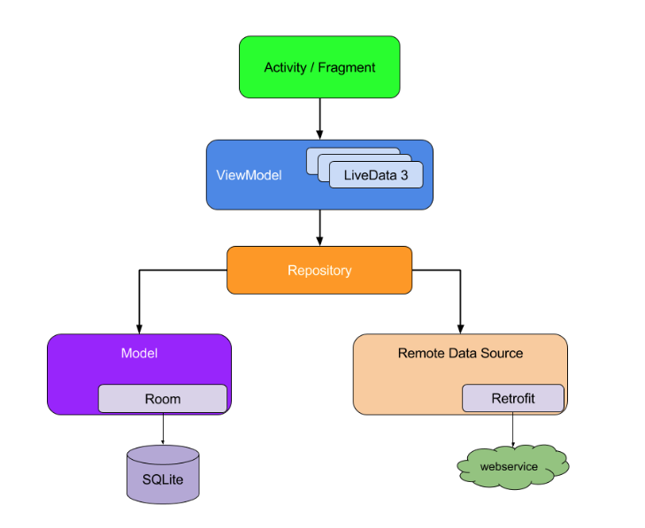
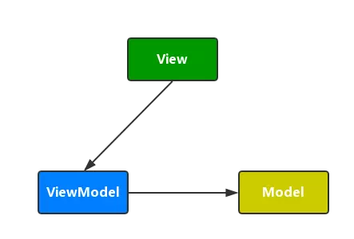
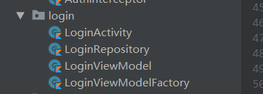
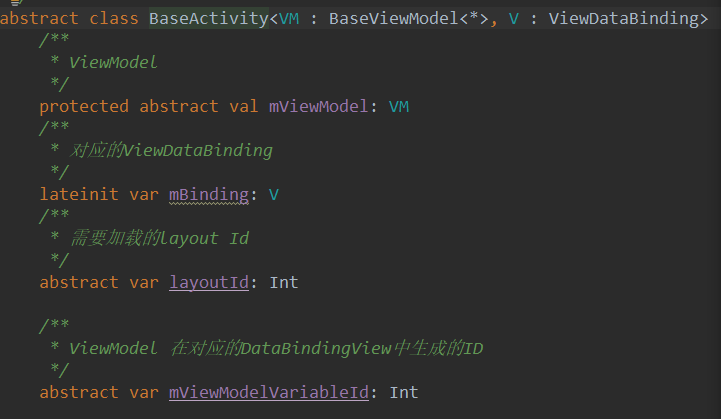

# MVVM_Demo

----------

**基于MVVM构建项目，主要运用了Jetpack中的相关组件：DataBinding、ViewModel、LiveData、Lifecycle等构建MVVM项目。**  

  
本项目主要是练习作用和自己参考许多GitHub构建了一个属于自己的MVVM Libary，对于以后自己在创建项目时可以直接依赖，即可完成基础框架的搭建。

 

### MVVM ###

   &nbsp;&nbsp;&nbsp;&nbsp;其实原来我开发一直是MVP模式，虽然感觉有很好解耦的作用，但是却多了很多的接口和在`Activity` 或 `Fragment`必须实现许多不必要的方法，编码量反而更加增多了，而且对于后期修改时，修改的地方反而很多，比如修改一个接口，需要修改`Presenter`、`View`反而修改很多，个人觉得对于小的项目反而用MVC能更加好的完成项目，而且速度也会快很多。
 

  &nbsp;&nbsp;&nbsp;&nbsp;对于MVVM我个人感觉解决了MVP那种要写多个接口的问题，而且相对于MVP来说，更加解耦，ViewModel完全不持有View甚至连View的接口都不需要持有，它只专注于数据的处理，更加解耦，这样对于ViewModel层来说是完全独立的，它的修改对于View层不会有直接的影响。所有的UI都是通过数据驱动修改，通过LiveData或DataBinding来实现，数据驱动UI的修改，更加逻辑清晰更加便捷。

   对于MVVM,这里上一个官方的图：

 这里的ViewModel有点类似于MVP中的Presenter的作用，但是其相对Presnter来说，功能更单一，且完全不会持有View中的一点引用，他们之间的关系，可以用下面一个图来说明:

它们之间的关系是单向的引用，而且每层之间不可越层去调用，这样的分层更加明确和职责的单一，整体结构更清晰。

### MVVM\_JetPack\_Lib ###

&nbsp;&nbsp;&nbsp;&nbsp;这是我自己参考许多大佬的博文和项目，自己总结的一个感觉适用于现阶段的我的Lib库，用于平常的项目用MVVM模式完成项目的开发。
	
&nbsp;&nbsp;&nbsp;&nbsp;对于一个功能模块，主要需要ViewModel View 和Repository来完成。以一个登录为例，需要LoginActivity，LoginViewModel,LoginRepository来完成这一功能。

其中LoginActivity持有一个ViewModel和ViewDataBing,LoginViewModel用于返回驱动UI改变的数据，DataBinding用于数据的绑定和一些简单逻辑的完成。

在使用本库时，只需要`Repository`实现`BaseRepository`实现相关处理方法，和编写自己的数据处理方法。

`LoginViewModel`实现`BaseViewModel`,持有一个`Repository`的引用，实现数据的获取和数据的处理

`LoginActivity`实现`BaseActivity`，对其相关的抽象属性进行赋值，完成初始化操作。

具体`BaseActivity`所做的一些初始化操作，请查看具体源码和Demo中的实际使用过程。

在本例中`Activity`作为`View`层，只引用了`ViewModel`层的`LoginViewModel`，而`ViewModel`层也只引用了`Model`层(这里的`Model`指的是`Repository`),从而实现了更加的解耦

### 对于使用的库 ###

&nbsp;&nbsp;&nbsp;&nbsp;对于网络框架，主要使用了我们常用的`Retrofit`+`RxJava`来完成一个异步的请求功能(以后可以考虑协成+`Retrofit`来完成)

ViewModel 官方组件，LiveData、Lifecycle这里推荐去看这位大佬的博客，讲的很详细：[学习博客](https://juejin.im/post/5c53beaf51882562e27e5ad9) 推荐去看这位大佬的一系列博客。

对于`DataBinding`感觉有点又爱又恨，使用起来之后确实可以方便许多，可以之间在xml中完成许多事，结合`BindingAdapter`确实可以实现一行xml代码完成许多功能，但是它也是有许多缺点，问题难定位，xml中写的时候，无法进行提示和一些错误的判断。但是怎么说也是google官方库，也有许多优点，所以就用了进来，我对于`DataBinding`的态度是使用但不会重度使用，因为其使用过多会影响代码的可读性(个人感觉)，所以我会结合`LiveData`一起使用，来完成数据驱动视图变化。

### 写在最后 ###

&nbsp;&nbsp;&nbsp;&nbsp;参考了许多大佬的项目和博客来实现的本MVVM库，以下是他们的博客和GitHub项目，谢谢他们的开源精神。

大佬们的地址：

[https://juejin.im/user/588555ff1b69e600591e8462](https://juejin.im/user/588555ff1b69e600591e8462)

[https://github.com/qingmei2/MVVM-Rhine](https://github.com/qingmei2/MVVM-Rhine)

[https://github.com/goldze/MVVMHabit](https://github.com/goldze/MVVMHabit)

[https://github.com/guolindev/coolweatherjetpack](https://github.com/guolindev/coolweatherjetpack)

[https://github.com/li-xiaojun/StateLayout](https://github.com/li-xiaojun/StateLayout)

[https://github.com/m4coding/CoolHub](https://github.com/m4coding/CoolHub)

推荐参考下google官方的demo:[https://github.com/googlesamples/android-architecture/tree/todo-mvvm-live-kotlin](https://github.com/googlesamples/android-architecture/tree/todo-mvvm-live-kotlin)

